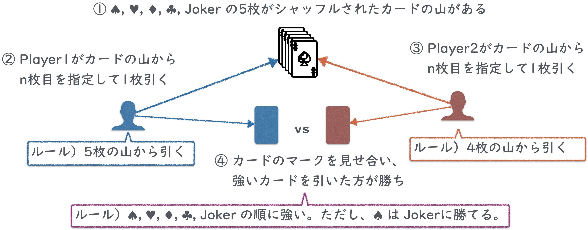

= クラスの構造と初歩のパターン

== はじめに

このプロジェクトは、ごく簡易なカードゲームを題材として、Javaのクラス作成パターンを意識する練習を狙ったハンズオン用のプロジェクトです。

Javaでプログラミングの基本文法や、`ArrayList` などの標準ライブラリの使い方を学んだレベルの学習者の利用を想定しています。

このプロジェクトで取り上げる（取り上げたい）内容は以下の通りです。

- クラス、フィールド、メソッド、コンストラクタ
- リスト
- イミュータブルとミュータブル
- クラスを跨ぐ処理の切り分け（サービス化）
- 列挙型
- 色々なものをクラスで表す
- [line-through]#同値性と同一性#（カードゲームに盛り込む良いサンプル を考え中...🤔)

本来、クラス作成（設計）のパターンには、各種のデザインパターンや、ドメイン駆動設計におけるドメインモデルパターンなど、実践的な体系が確立されています。 +
このハンズオンはより初心者向けに、前述のパターンなどに手をかける前の手習いとして「積極的にクラスを作る」練習をする部分を狙っています。

== 解説資料

== お題

